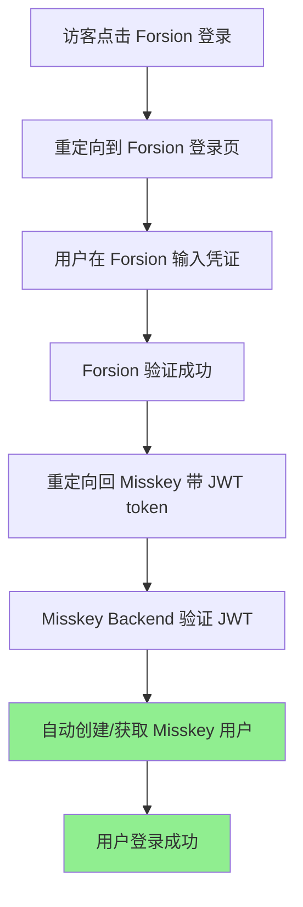
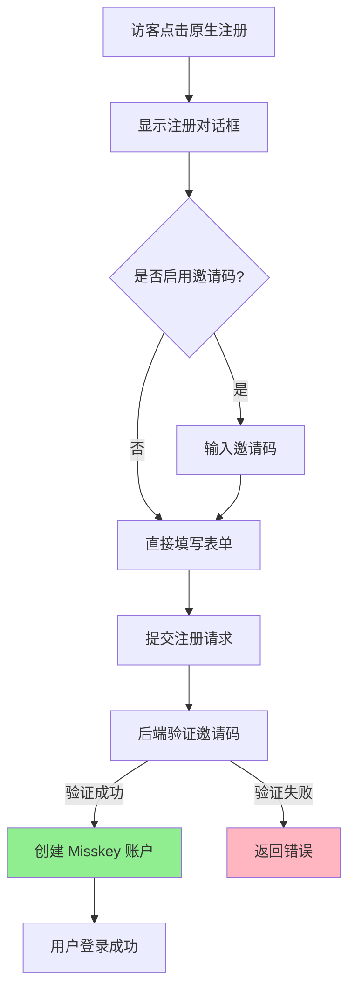

# 双重登录系统实现 - Forsion + 原生登录

**日期**: 2026-02-04  
**版本**: v3.0 (双重登录模式)

## 概述

实现了同时支持 Forsion 统一账号登录和 Misskey 原生账号登录的双重登录系统。用户可以选择使用 Forsion 账号（无需邀请码）或使用 Misskey 原生账号（需要邀请码）进行注册和登录。

## 核心特性

1. **双登录方式共存**: Forsion 登录和原生登录同时可用
2. **Forsion 登录免邀请码**: 使用 Forsion 账号登录自动创建用户，无需邀请码
3. **原生登录保留邀请码机制**: 使用原生 Misskey 注册仍需邀请码（如果 `disableRegistration` 启用）
4. **统一界面**: 访客欢迎页和登录对话框都支持两种登录方式

## 实施内容

### 1. 重建 MkVisitorDashboard.vue（访客欢迎页）

**文件**: `misskey-develop/packages/frontend/src/components/MkVisitorDashboard.vue`

**背景**: 该文件在之前的修改中被删除，导致欢迎页面无法显示。

**新实现**:

```vue
<div class="_gaps_s" :class="$style.mainActions">
    <!-- Forsion Login Button (always visible) -->
    <MkButton :class="$style.mainAction" full rounded gradate data-cy-forsion-login @click="loginWithForsion()">
        <i class="ti ti-login"></i> 使用 Forsion 账号登录
    </MkButton>
    
    <!-- Divider -->
    <div :class="$style.divider">
        <span>{{ i18n.ts.or || '或者' }}</span>
    </div>
    
    <!-- Native Misskey Signup/Signin -->
    <MkButton :class="$style.mainAction" full rounded data-cy-signup @click="signup()">
        {{ i18n.ts.joinThisServer }}
    </MkButton>
    <MkButton :class="$style.mainAction" full rounded data-cy-signin @click="signin()">
        {{ i18n.ts.login }}
    </MkButton>
</div>
```

**按钮布局**:
- **Forsion 登录按钮** (渐变紫色，带图标) - 始终显示在顶部
- **分隔线** ("或者" 文字) - 视觉分隔两种登录方式
- **原生注册按钮** - 打开 Misskey 注册对话框
- **原生登录按钮** - 打开 Misskey 登录对话框

**移除内容**:
- "Look for another instance" (探索其他服务器) 链接 - 对私有实例不需要

### 2. 更新 MkSignin.vue（登录对话框）

**文件**: `misskey-develop/packages/frontend/src/components/MkSignin.vue`

**之前的问题**: 
- 使用 `v-if="showForsionLogin"` 和 `v-if="!showForsionLogin"` 互斥显示
- 启用 Forsion 后，原生登录完全被隐藏

**新实现**:
- Forsion 登录按钮始终在顶部显示（当 Forsion 配置启用时）
- 添加 "或者" 分隔线
- 原生登录流程始终在下方显示
- 两种登录方式并存，用户可自由选择

**模板结构**:

```vue
<div :class="$style.signinRoot">
    <!-- Forsion Login (shown when Forsion is enabled) -->
    <div v-if="showForsionLogin" :class="$style.forsionLoginContainer">
        <button :class="$style.forsionLoginButton" @click="onForsionLogin">
            <i class="ti ti-login"></i>
            {{ i18n.ts._forsion?.loginWithForsion || 'Login with Forsion' }}
        </button>
        <p :class="$style.forsionHint">
            {{ i18n.ts._forsion?.useUnifiedAccount || 'Use your unified Forsion account to login' }}
        </p>
        
        <!-- Divider when both options are available -->
        <div :class="$style.divider">
            <span>{{ i18n.ts.or || '或者' }}</span>
        </div>
    </div>

    <!-- Native Misskey Login (always shown) -->
    <Transition>
        <!-- Username/Password flow -->
    </Transition>
</div>
```

**样式新增**:

```scss
.divider {
    position: relative;
    text-align: center;
    margin: 20px 0;
    
    &::before {
        content: '';
        position: absolute;
        top: 50%;
        left: 0;
        right: 0;
        height: 1px;
        background: var(--MI_THEME-divider);
    }
    
    span {
        position: relative;
        display: inline-block;
        padding: 0 12px;
        background: var(--MI_THEME-panel);
        color: var(--MI_THEME-fg);
        opacity: 0.6;
        font-size: 0.9em;
    }
}
```

### 3. 后端邀请码处理（无需修改）

**确认行为**: 
- `ForsionUserProvisionService.ts` 的 `createMisskeyUserFromForsion()` 方法**不检查**邀请码
- Forsion 用户通过 JWT 验证后直接创建 Misskey 账户
- 原生注册流程继续使用 `SignupApiService.ts` 的邀请码验证

## 登录流程对比

### Forsion 登录流程



**特点**:
- ✅ 无需邀请码
- ✅ 自动创建账户
- ✅ 统一账号管理
- ✅ 支持跨应用单点登录

### 原生登录流程



**特点**:
- ⚠️ 需要邀请码（如果启用 `disableRegistration`）
- ⚠️ 独立的账号系统
- ✅ 支持本地账户管理
- ✅ 适合不依赖外部系统的场景

## 用户体验流程

### 访客访问欢迎页

1. 看到三个按钮：
   - **使用 Forsion 账号登录** (紫色渐变，突出显示)
   - ——— 或者 ———
   - **注册本站账号** (Join This Server)
   - **登录本站账号** (Sign In)

2. 用户选择登录方式：

   **选项 A: 使用 Forsion 登录**
   - 点击 "使用 Forsion 账号登录"
   - 跳转到 Forsion 登录页面
   - 输入 Forsion 账号密码
   - 自动回到 Misskey，无需注册，直接登录

   **选项 B: 使用原生账号注册**
   - 点击 "注册本站账号"
   - 打开注册对话框
   - 如果启用邀请码，需要输入邀请码
   - 填写用户名、密码等信息
   - 注册成功后登录

   **选项 C: 使用原生账号登录**
   - 点击 "登录本站账号"
   - 打开登录对话框
   - 选择 Forsion 或原生方式登录
   - 输入凭证完成登录

### 登录对话框（MkSignin）

当用户点击 "登录本站账号" 后：

1. 对话框显示：
   - **Login with Forsion** 按钮（如果 Forsion 配置启用）
   - ——— 或者 ———
   - 用户名输入框
   - 继续按钮（进入密码输入）

2. 用户可以：
   - 直接点击 "Login with Forsion" 跳转外部登录
   - 或输入用户名继续原生登录流程

## 配置要求

### 前端环境变量

**文件**: `misskey-develop/packages/frontend/.env`

```env
# Forsion 登录页面 URL
VITE_FORSION_AUTH_URL=http://localhost:3001/auth

# Forsion Backend API URL
VITE_FORSION_API_URL=http://localhost:3001
```

### 后端配置

**文件**: `misskey-develop/.config/default.yml`

```yaml
forsion:
  enabled: true
  apiUrl: 'http://localhost:3001'
```

### 邀请码设置

**文件**: `misskey-develop/.config/default.yml`

```yaml
# 是否禁用公开注册（启用邀请码模式）
disableRegistration: true

# 或者允许公开注册
disableRegistration: false
```

**行为说明**:
- `disableRegistration: true` - 原生注册需要邀请码，Forsion 登录不需要
- `disableRegistration: false` - 原生注册和 Forsion 登录都不需要邀请码

## 技术实现要点

### 1. 组件状态管理

**MkVisitorDashboard.vue**:
- 无条件渲染三个按钮
- `loginWithForsion()` 调用 `redirectToForsionLogin('misskey')`
- `signin()` / `signup()` 打开对应对话框

**MkSignin.vue**:
- `showForsionLogin` 计算属性检查 `isForsionEnabled()`
- 当 Forsion 启用时，渲染 Forsion 按钮 + 分隔线 + 原生登录
- 当 Forsion 未启用时，只渲染原生登录流程

### 2. 样式一致性

两个组件的分隔线样式保持一致：
- 使用 CSS 伪元素 `::before` 绘制横线
- 文字居中显示在横线上方
- 背景色与面板背景一致，形成视觉分隔

### 3. 用户账户映射

**Forsion 用户**:
- 存储在 `forsion_user_mapping` 表
- `forsionUserId` → `misskeyUserId` 一对一映射
- 用户名自动生成（基于 Forsion username，冲突时添加数字后缀）

**原生用户**:
- 直接存储在 `user` 表
- 通过邀请码创建（如果启用 `disableRegistration`）
- 用户名由用户在注册时输入

### 4. 认证流程兼容性

**AuthenticateService.ts** 处理逻辑：

```typescript
// 1. 检查是否为 Forsion JWT token
if (this.forsionAuthService.isForsionToken(token)) {
    // 调用 Forsion API 验证
    const forsionUserInfo = await this.forsionAuthService.verifyToken(token);
    // 获取或创建 Misskey 用户
    const user = await this.forsionUserProvisionService.getOrCreateUser(forsionUserInfo);
    return [user, null];
}

// 2. 检查是否为 Misskey 原生 token
if (isNativeUserToken(token)) {
    // 查找本地用户
    const user = await this.usersRepository.findOneBy({ token });
    return [user, null];
}

// 3. 检查是否为 OAuth AccessToken
const accessToken = await this.accessTokensRepository.findOne({ ... });
const user = await this.usersRepository.findOneBy({ id: accessToken.userId });
return [user, accessToken];
```

## 文件变更清单

### 修改的文件

1. ✅ `misskey-develop/packages/frontend/src/components/MkVisitorDashboard.vue`
   - **操作**: 重新创建（之前被删除）
   - **变更**: 添加 Forsion 登录按钮 + 分隔线 + 原生登录/注册按钮
   - **移除**: "Look for another instance" 链接

2. ✅ `misskey-develop/packages/frontend/src/components/MkSignin.vue`
   - **操作**: 修改模板逻辑
   - **变更**: 移除互斥的 `v-if` 逻辑，改为并存显示
   - **新增**: 分隔线样式

### 未修改的文件（验证现有行为）

- `misskey-develop/packages/backend/src/server/api/ForsionUserProvisionService.ts` - 已确认不检查邀请码
- `misskey-develop/packages/backend/src/server/api/SignupApiService.ts` - 原生注册继续使用邀请码验证
- `misskey-develop/packages/frontend/src/components/MkSignupDialog.form.vue` - 邀请码输入逻辑保持不变

## 测试验证

### 测试场景 1: Forsion 登录（无邀请码）

1. 启动 Forsion Backend 和 Misskey
2. 访问 Misskey 欢迎页
3. 点击 "使用 Forsion 账号登录"
4. 在 Forsion 登录页输入凭证
5. **预期结果**: 自动回到 Misskey，首次登录自动创建账户，无需邀请码

### 测试场景 2: 原生注册（需要邀请码）

1. 配置 `disableRegistration: true`
2. 访问 Misskey 欢迎页
3. 点击 "注册本站账号"
4. **预期结果**: 注册对话框显示邀请码输入框（必填）
5. 输入有效邀请码和注册信息
6. **预期结果**: 注册成功，登录系统

### 测试场景 3: 原生登录

1. 访问 Misskey 欢迎页
2. 点击 "登录本站账号"
3. **预期结果**: 登录对话框显示 Forsion 按钮和原生登录表单
4. 输入用户名密码
5. **预期结果**: 登录成功

### 测试场景 4: 登录对话框双选项

1. 打开登录对话框
2. **预期结果**: 
   - 顶部显示 "Login with Forsion" 按钮
   - 中间显示 "或者" 分隔线
   - 下方显示用户名输入框和继续按钮
3. 点击 Forsion 按钮
4. **预期结果**: 跳转到 Forsion 登录页

## 优势与限制

### 优势

✅ **灵活性**: 用户可选择两种登录方式  
✅ **平滑过渡**: 现有用户不受影响，新用户可选 Forsion  
✅ **降低门槛**: Forsion 用户无需邀请码，降低注册门槛  
✅ **保留控制**: 原生注册仍可使用邀请码控制  
✅ **统一体验**: 两种方式界面一致，用户体验统一  

### 限制

⚠️ **账号不互通**: Forsion 账号和原生账号是独立的  
⚠️ **无法合并**: 同一用户在两个系统的账号无法自动关联  
⚠️ **配置复杂度**: 需要同时维护两套认证配置  

## 后续优化建议

### 短期优化

1. **错误提示优化**: 当 Forsion 未配置时，提供友好的错误提示
2. **加载状态**: 在跳转 Forsion 登录页时显示加载动画
3. **国际化**: 为 "或者" 分隔线添加完整的 i18n 支持

### 长期优化

1. **账号关联**: 允许用户将 Forsion 账号与现有原生账号关联
2. **SSO 集成**: 实现真正的单点登录，支持跨应用会话共享
3. **用户迁移工具**: 提供工具帮助原生用户迁移到 Forsion 账号
4. **管理界面**: 在管理面板添加 Forsion 用户映射管理功能

## 相关文档

- JWT 验证修复: `Document/Log/2026-02-04-JWT验证方式修复说明.md`
- Forsion 集成指南: `misskey-develop/FORSION_INTEGRATION.md`
- 配置示例: `misskey-develop/FORSION_CONFIG_EXAMPLE.yml`
- Skill 文档: `.cursor/skills/forsion-login-integration/SKILL.md`

## 总结

本次实施成功实现了 Forsion 统一登录和 Misskey 原生登录的并存，用户可根据需求选择合适的登录方式。Forsion 登录提供无邀请码的便捷体验，而原生登录保留了邀请码机制，适合需要控制注册的场景。两种方式通过清晰的界面设计和一致的用户体验实现了完美融合。
